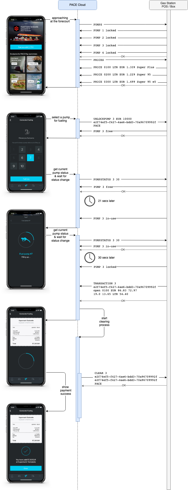

# OpenFSC Protocol Specification (Version 1.0)


Copyright (c) 2019–2024 PACE Telematics GmbH

## Table of contents

- [OpenFSC Protocol Specification (Version 1.0)](#openfsc-protocol-specification-version-10)
  - [Table of contents](#table-of-contents)
  - [1 About This Document](#1-about-this-document)
    - [1.1 Not Part of this Document](#11-not-part-of-this-document)
  - [2 Architecture Overview](#2-architecture-overview)
    - [2.1 Parties](#21-parties)
    - [2.2 Requirements](#22-requirements)
  - [3 Process Overview](#3-process-overview)
    - [3.1 Post-Pay Process](#31-post-pay-process)
    - [3.2 Pre-Auth Process](#32-pre-auth-process)
  - [4 Communication Protocol](#4-communication-protocol)
    - [4.1 Plain Text Protocol](#41-plain-text-protocol)
      - [4.1.1 TAG](#411-tag)
      - [4.1.2 Methods and Arguments](#412-methods-and-arguments)
        - [Handshake/Not Authenticated State](#handshakenot-authenticated-state)
          - [`CAPABILITY`](#capability)
          - [`CHARSET` (Encoding Method)](#charset-encoding-method)
          - [`PLAINAUTH` (Authentication Method)](#plainauth-authentication-method)
        - [Authenticated State](#authenticated-state)
          - [`CLEAR`](#clear)
          - [`HEARTBEAT`](#heartbeat)
          - [`LOCKPUMP`](#lockpump)
          - [`PRICE`](#price)
          - [`PRICES`](#prices)
          - [`PUMP`](#pump)
          - [`PUMPS`](#pumps)
          - [`PUMPSTATUS`](#pumpstatus)
          - [`TRANSACTION`](#transaction)
          - [`TRANSACTIONS`](#transactions)
          - [`UNLOCKPUMP`](#unlockpump)
          - [`LOCKEDPUMP`](#lockedpump)
        - [General (Always Valid/Special Methods)](#general-always-validspecial-methods)
          - [`BEAT`](#beat)
          - [`ERR` (Special)](#err-special)
          - [`OK` (Special)](#ok-special)
          - [`QUIT`](#quit)
      - [4.1.3 Example Plaintext Session](#413-example-plaintext-session)
      - [4.1.4 EBNF](#414-ebnf)
      - [4.1.5 Protocol Extensions](#415-protocol-extensions)
      - [4.1.6 Supported Currencies](#416-supported-currencies)

## 1 About This Document

This document describes the measures required to enable a gas station forecourt system to be part of Connected Fueling Platform. The whole process is also known as "pay-at-the-pump" and enables a customer to pay for fuel using a smartphone (or directly within the car using the integrated HMI systems) while staying on the forecourt without entering the gas station shop.

The process can simply be described as follows:

- A customer stops the car at the forecourt
- Using the app the customer selects the correct pump and can inspect the fueling related data
- The customer refuels...
- A Mobile Payment is issued by the user using the mobile app

The above example describes the flow for a mobile phone, the flow for a car HMI is exactly the same. Because of that, all examples are done using the mobile app term.

The Fueling Site Connect API is hereinafter referred to as "OpenFSC".

### 1.1 Not Part of this Document

The payment process is not directly part of this document, due to the fact, that payment is the responsibility of the OpenFSC server side. The server is signaling to the gas station, that the fueling was payed.

On-boarding of the gas station requires some meta data about the station. That includes but is not limited to data like the address, the geo location (latitude, longitude), brand and station name. The data is important for the customer to be routed to a gas station, understand the current pump selection or allow the app to automatically find the correct gas station for a given location.

However, there's a document outlining expected data and ways to integrate:

- [PACE POI Service: Gas Station Data](https://docs.pace.cloud/en/services/poi-service/gas-station-data)

The documentation for the API and the interaction between the App and the Connected Fueling API can be found here:

- [PACE Developer Documentation](https://docs.pace.cloud/)
- [Connected Fueling API Documentation](https://developer.pace.cloud/overview)

## 2 Architecture Overview

- The gas station (often also known as Site) uses either a POS (Point of Sale) or a dedicated hardware (Site Connect Box) that connects to the OpenFSC server in order to enable Mobile Payment.
- In order to connect the POS or any dedicated hardware to an OpenFSC server, an internet connection in conjunction with simple but secure communication protocols is used.
- On the customer side, multiple clients are implementing the Connected Fueling API, ranging from HMI (Human Machine Interfaces) in new cars to retrofit solutions like the PACE Car platform, PACE Drive and many other mobility-focussed mobile apps.


### 2.1 Parties

Main parties in the Connected Fueling process are

- The **customer** with the **mobile app**
  Uses some client for the Connected Fueling Platform in order to get up-to-date information about the gas station, and pay for fuel later.

- The **gas station** using either a **POS**, a connected **Site controller**, a **Site Connect software** running somewhere within the stations network or **Site Connect Box** running the software.

  One of the above components starts the connection to the OpenFSC server to provide prices, pumps, (open) transactions and accepts transaction clearing.

- **PACE** with its **Connected Fueling** platform

  Accepting connections from many parties (Mobile apps, In-car HMI systems, ...), translates (proprietary) protocols and exchanges the station, pump, fueling and payment information.

### 2.2 Requirements

The following minimal requirements are assumed when implementing OpenFSC:

- An internet connection
- Ability to connect to an OpenFSC server via either
  - Secure WebSockets over port 443 (TLS 1.2)
  - Plaintext based TCP stream protocol over a secured VPN (eg. IPSec)
- Access to the pump status information for all pumps
- Ability to inform OpenFSC server about changes of the pump status
- Access to the current fuel prices, including the product id, name, ...
- Ability to inform OpenFSC server about price changes when they occur
- Access to current, uncleared transactions on the pumps including
  - a transaction ID
  - the transaction state
  - the product ID
  - the fueled amount
  - the total net and gross prices, VAT rate
- Information about the currency used as well as current time
- Authentication data, needed to connect to an OpenFSC Server

## 3 Process Overview

The Connected Fueling process can be divided into two main processes: the Post-Pay and the Pre-Auth process. The Post-Pay process is very prominent in Germany and represents the payment after the fueling. The Pre-Auth process is widely used outside of Germany or with 24/7 unmanned stations. Both processes can be implemented using the OpenFSC protocol. Both processes are described using the plain text protocol (secured using TLS1.2 or VPN) offered by OpenFSC.

Both processes start by updating the current pumps and price information, in order to present current data to the user. The price information needs to be sent via OpenFSC when changed in order to show current prices to the users that haven't already reached the forecourt.

### 3.1 Post-Pay Process

- The user then selects the current pump which is reflected in the protocol by once again retrieving the updated status. That is because the user can go back to the overview and select another pump, in case the pump was mistakenly chosen. Having current pump information is, therefore, the first step.
- Using the pump status method with a ttl (time to live) for the update will ask the client to continuously send updates for the given pump for a given amount of time.
- If the pump status reaches the **ready-to-pay** state, open transactions will be requested using OpenFSC. The information will be used to show a nicely formatted bill to the customer.
- The customer selects the payment method and pays using a payment method they already registered with his digital wallet. Please note: The registration of payment methods is not covered by this document.


### 3.2 Pre-Auth Process

- The user has to pre-authorize the payment, the amount is explicitly chosen by the user OR implicitly set high enough, such that a full fueling could take place (tank size _fuel type price_ 120%).
- The status updates work in the same way as with a Post-Pay fueling, the only difference is, that the process waits until the state **locked** is reached. The pre-authorized amount will be captured by the gas station by providing the quantity of product dispensed and the total price.
- In case of cancellation (no fuel delivered), the client does not report a transaction but uses the [`LOCKEDPUMP`](#lockedpump) command to indicate the cancellation of the process.
- The user will be presented with the transaction receipt/delivery note and informed that the transaction is complete.



## 4 Communication Protocol

This section specifies the general communication protocol between a Site and the OpenFSC server.

The protocol is independent of the particular transmission subsystem and requires only a reliable and ordered data channel (e.g. WSS or TCP stream).

Ususally, a single communication channel is distinct to a single client-server pair. You can use the [Connection Multiplexing](ext/connection-multiplexing.md) extension in your implementation if you would like to connect multiple Sites through a single client-server connection.

The Site has to initiate the connection to the OpenFSC server. In case the connection dropped the Site needs to reconnect immediately.

### 4.1 Plain Text Protocol

The protocol consists of predefined messages. A message always starts with a so called `tag` followed by a `method`, multiple arguments `arg0` - `argN` as well as a special optional last argument `argV`. The end of a message is indicated by `<CRLF>` (`\r\n`):

```xml
<tag> <method> <arg0> <arg1> ... <argN> <argV>\r\n
```

All message fields except the termination sequence `<CRLF>` are separated by spaces and the default message encoding is `ASCII`. To change the encoding a special method called `CHARSET` can be used which is described in a later section.

To establish a connection, the client first establishes a data channel (e.g.: TCP) to the server and starts a handshaking process to establish the actual Site API connection. This initialization phase is a so-called "Not Authenticated State" and consists of a special sequence of messages to negotiate the communication contract between the server and the client. The first message from both sides always has to be a notification with a `CAPABILITY` message. If an error occurs on either side the corresponding party will disconnect and optionally send a `QUIT` notification with further information about the error. In case of a successful capability exchange, the client can change the protocol encoding by sending one of the available encoding messages specified further below. The initialization phase will be concluded with an authentication message like `PLAINAUTH`. If everything was successful, the connection is considered established and transitions into a so-called "Authenticated State".


#### 4.1.1 TAG

The `<tag>` indicates the type of the message as well as the current context and needs to satisfy the format `"*" | letter { letter | digit }` (see EBNF for full specification). There are currently two supported message types:

**Request/Response** - indicated by the tag `letter { letter | digit }`

In this case the tag specifies the message context, which means if one party sends a request message with the tag `S1` the receiving end will answer with the same tag `S1` in its response. The established context is valid until a timeout is triggered or the recipient answers with an `OK` or `ERR` response. The tag of a request must match the tag of its response.

```text
S: S6 HEARTBEAT 2019-11-13T07:00:04Z
C: S6 BEAT 2019-11-13T08:00:05+01:00
C: S6 OK
```

**Notification** - indicated by the tag `"*"`

A notification indicates a message which expects no response. Besides the reliable transport requirement, this means there is no acknowledgement of any form that the sent message was processed correctly.

```text
C: * PUMP 1 free
C: * PUMP 2 free
C: * PUMP 3 in-use
C: * PUMP 4 ready-to-pay
```

A notification can also be a synchronous answer to a previously issued request/response:

```text
S: S1 PUMPS
C: * PUMP 1 free
C: * PUMP 2 free
C: * PUMP 3 in-use
C: * PUMP 4 ready-to-pay
C: S1 OK
```

#### 4.1.2 Methods and Arguments

A message represents an operation that should be performed by the receiving side. Each message consists of a method and a list of defined arguments. Each method has its own arguments and message type (Request/Response or Notification). The name of the method must follow the format `letter { letter | digit }` while all normal arguments (`arg0`- `argN`) can use all characters of the specified encoding except control characters and space (`"\x21"…"\x7E"`). The method and all arguments are separated by spaces. The last argument can be a so called "variadic" argument (`argV`) which supports a sequence of any character compatible with the negotiated protocol encoding besides `<CRLF>` (`"\x00"…"\xff" - "\r" - "\n"`). The last argument (`argN` or `argV`) as well as the whole message is terminated by `<CRLF>` (`\r\n`).

##### Handshake/Not Authenticated State

###### `CAPABILITY`

Type: **Notification**

Direction: **Server → Client, Client → Server**

This is the first message always issued by both parties respectively, containing information about the available methods of the sending party. If an error occurs while receiving/processing the capabilities of the other party, the recipient should terminate the connection. Optionally they can send a **QUIT** message to provide extra information before triggering the disconnect.

Arguments:

- **Whitespace separated list of methods supported by the sending party**

Please note that the list of capabilities is of variable (not fixed) length.

###### `CHARSET` (Encoding Method)

Type: **Request/Response**

Direction: **Client → Server**

Change the protocol encoding for all subsequent messages. If the encoding change was successful, OK will be returned. In case of an error the server returns an ERR message. **CAUTION:** The response to this request will still use the old encoding (default: `ASCII`).

Arguments:

- **Name** (arg0, string): supported values: `WINDOWS-1252`, `ISO-8859-1`, `UTF-8` \*\*\*\*(more charsets possible on request)

Errors:

- **404** Unknown encoding

###### `PLAINAUTH` (Authentication Method)

Type: **Request/Response**

Direction: **Client → Server**

Trigger an authentication process usually from the client side, with plain credentials. If the authentication was successful, OK will be returned. In case of an error the server responds with an ERR message.

Arguments:

- **SiteAccessKey** (arg0, uuid): identification of the connecting site
- **Secret** (arg1, string): corresponding secret for proof of identification

Errors:

- **401** SiteAccessKey and/or secret are not valid

##### Authenticated State

###### `CLEAR`

Type: **Request/Response**

Direction: **Server → Client**

Mark a transaction as cleared from server side. This frees the occupied pump and deletes the corresponding transaction. If the operation was successful, OK will be returned. In case of an error the client returns an ERR message.

In case the clear could not be acknowledged by the client side due to a network disconnect, the clear is half processed.
The transaction can now be in two states, `cleared` and `open`. In case the transaction is still `open` it will be reported by the usual `TRANSACTIONS` call, the server can safely assume the `CLEAR` was never received and retry. In case the transaction was `cleared` the transaction is not reported by the `TRANSACTIONS` call. The server doesn't know if this was caused by the `CLEAR`,
or a payment in the shop. To resolve the information issue, the server will retry to clear the transaction after the client reconnected.
If the client reports **403** the payment was done externally and **not** cleared by the server, usually by paying in the shop. If the client reports **410** the initial `CLEAR` was processed by the client and the server can now assume that the payment was successfully made. Some clients may only store the transaction for a certain time period (e.g. 24h). If the connection is not established for that time period, the client may responds with **404** the transaction isn't known any longer, this will cause an expensive back office process and should be avoided if possible. Summary of the errors on retry and how they are understood:

- **404** Initial clearing was too long ago, the client doesn't known about the transaction any longer → back office process
- **403** The payment was done otherwise → the payment transaction will be canceled
- **410** The transaction was accepted → transaction successful

**Important:** Please make sure that transactions cleared via OpenFSC are marked as such in the **reconciliation lists** shared with the MOC. eg. by adding a field "Clearance source" with a value "Connected Fueling" and the used **PaymentMethod** to the lists.

Arguments:

- **Pump** (args0, number): identifier of the concerned pump. Lowest possible value: 1.
- **SiteTransactionID** (arg1, string): ID of the transaction which should be cleared. Defined by the client with a previous TRANSACTION message. In case of UNLOCKPUMP the **SiteTransactionID** and **FSCTransactionID** may be the same, since the site returns the transaction id provided by OpenFSC.
- **FSCTransactionID** (arg2, uuid): ID defined by the server side. If the transaction was triggered with UNLOCKPUMP the ID must match with the one of the previous UNLOCKPUMP method.
- **PaymentMethod** (arg3, string): Name of the payment method used e.g. `pace`, `dkv`, ...

Errors:

- **404** Pump and SiteTransactionID unknown
- **403** Payment method not permitted
- **410** SiteTransactionID not open any longer and FSCTransactionID was the same

###### `HEARTBEAT`

Type: **Request/Response**

Direction: **Server → Client**

Check if the client is still available and try to calculate the time drift between server and client. This method is issued regularly to detect the time drift and to check if the communication channel between server and client is up and running.
	
The client answers with a tagged `BEAT` message before sending an `OK`. If an error occurred the client returns an `ERR` message.
	
The `HEARTBEAT` message must be answered by the client within 20 seconds, otherwise the communication channel is considered unstable. Multiple failures in answering in time will result in the communication channel being forcefully closed (`QUIT`).

Arguments:

- **Timestamp** (arg0, string): time at which this message was sent in the format of `RFC-3339`.

Errors:

- **422** Timestamp invalid

###### `LOCKPUMP`

Type: **Request/Response**

Direction: **Server → Client**

Cancel a previously with UNLOCKPUMP issued fueling process from the server side. If the operation was successful, OK will be returned. In case of an error, the client returns an ERR message.

Arguments:

- **Pump** (arg0, number): identifier of the concerned pump. Lowest possible value: 1.

Errors:

- **402** Payment required (pump can't be locked due to a pending payment)
- **404** Pump unknown
- **423** Already locked

###### `PRICE`

Type: **Notification**

Direction: **Client → Server**

Price of a specific product in price per litre. Should be sent as reaction to a previous PRICES message and may be sent pro-actively if a price changes.

Arguments:

- **ProductID** (arg0, string): identifier of the product. (e.g.: 0100)
- **Unit** (arg1, string): unit used by the subsequent **PricePerUnit** argument. Supported values: **LTR**
- **Currency** (arg2, string): currency used by the subsequent **PricePerUnit** argument. Supported values, see [Supported Currencies](#416-supported-currencies), for example **EUR**.
- **PricePerUnit** (arg3, decimal): end user price per unit including VAT in the specified **Unit** (arg1) and the specified **Currency** (arg2). (e.g. for EUR/LTR: 1.339)
- **Description** (argV): human readable name/description of the product. (e.g.: Super Plus)

Please consider implementing the [product mapping extension](ext/product-mapping.md) for your client to announce products with their respective type prior to transferring price information.

###### `PRICES`

Type: **Request/Response**

Direction: **Server → Client**

Get the current prices for all available products in the form of price per litre. The client needs to make sure that all prices have been transmitted with PRICE notifications before they can send an OK to conclude the PRICES request. In case of an error the client returns an ERR message.

Arguments: **None**

###### `PUMP`

Type: **Notification**

Direction: **Client → Server**

Status of a specific pump sent from the client. Should be sent as reaction to a PUMPS, PUMPSTATUS, UNLOCKPUMP message and may be sent pro-actively if the status of a pump changes.

Arguments:

- **Pump** (arg0, number): identifier of the pump. Lowest possible value: 1.
- **Status** (arg1, string)**:** status of the current pump. Supported values: **free**, **in-use, in-transaction**, **ready-to-pay, locked** or **out-of-order**

###### `PUMPS`

Type: **Request/Response**

Direction: **Server → Client**

Get the statuses of all pumps at the site. The client needs to make sure that all pump states have been transmitted with PUMP notifications before they can send an OK to conclude the PUMPS request. In case of an error the client returns an ERR message.

Arguments: **None**

###### `PUMPSTATUS`

Type: **Request/Response**

Direction: **Server → Client**

Get the status of a specific pump. The client needs to make sure that the requested pump state has been transmitted with a PUMP notification before they can send an OK to conclude the PUMPSTATUS request. In case of an error the client returns an ERR message.

Arguments:

- **Pump** (arg0, number): identifier of the concerned pump. Lowest possible value: 1.
- **UpdateTTL** (arg1, number, optional): time to live in seconds for expected update signals from the client. After the OK response the client informs the server about status changes of the specified pump till the TTL is reached. Explicitly only status changes should be sent in this case.

Errors:

- **404** Pump unknown
- **416** UpdateTTL is too large or too low (valid range 30 - 300)

###### `TRANSACTION`

Type: **Notification**

Direction: **Client → Server**

Information about a specific transaction of a pump, open or deferred. Should be sent as reaction to a previous TRANSACTIONS message and may be sent pro-actively if the status of a transaction changes.

Note: `TRANSACTION` shall only be used if a product was actually dispensed (non-zero amount/quantity transaction). In case of cancellation on station side without a product being dispensed, please use [`LOCKEDPUMP`](#lockedpump) instead (only applicable when using the pre-auth workflow).

Arguments:

- **Pump** (arg0, number): identifier of the concerned pump. Lowest possible value: 1.
- **SiteTransactionID** (arg1, string): ID of this transaction (defined by the client, site) in case of the Post-Pay Process. In case of the Pre Pay Process the SiteTransactionID is the **FSCTransactionID** (provided on `UNLOCKPUMP`).
- **Status** (arg2, string): the current status of the transaction. Must be either **open** or **deferred**. A transaction is **open** if the payment has not yet been settled and the pump is **ready-to-pay** or **locked**. A transaction is **deferred** if it was previously **open** but the pump was released again by the site operator (set to **free**). This could be the case if a customer was not able to pay his fueling and the site operator needs to take further actions. To not block the pump for other customers, the site operator releases it again and the transaction previously **open** for said pump will be marked as **deferred.**
- **ProductID** (arg3, string): identifier for the used product.
- **Currency** (arg4, string): currency used by the subsequent **PriceWithVAT, PriceWithoutVAT** and **VATAmount** argument. Supported values, see [Supported Currencies](#416-supported-currencies), for example **EUR**.
- **PriceWithVAT** (arg5, decimal): price including VAT, associated with the current transaction in the specified **Currency** (arg4). (e.g for EUR: 86.83)
- **PriceWithoutVAT** (arg6, decimal): price excluding VAT, associated with the current transaction in the specified **Currency** (arg4). (e.g. for EUR: 72.97)
- **VATRate** (arg7, decimal): rate of VAT used in the previous **PriceWithVAT** argument in percent. (e.g.: 19.0)
- **VATAmount** (arg8, decimal): amount of VAT used in the previous **PriceWithVAT** argument in the specified **Currency** (arg4). \*\*\*\*(e.g. for EUR: 13.65)
- **Unit** (arg9, string): unit used by the subsequent **Volume** argument. Supported values: **LTR**
- **Volume** (arg10, decimal): amount of product used in the specified **Unit** (arg9). (e.g. for LTR: 54.40)
- **PricePerUnit** (arg11, decimal): end user price per unit including VAT in the specified **Unit** (arg9) and the specified **Currency** (arg4). (e.g. for EUR/LTR: 1.339)

###### `TRANSACTIONS`

Type: **Request/Response**

Direction: **Server → Client**

Get all open or deferred transactions of the site or a specified pump (optional). The client needs to make sure that all transactions have been transmitted with TRANSACTION notifications before they can send an OK to conclude the TRANSACTIONS request. In case of an error the client returns an ERR message. The transactions may be requested after the successful connection of a client with session mode active in order to clear open transactions.

Arguments:

- **Pump** (arg0, number, optional): identifier of wanted pump. Lowest possible value: 1.
- **UpdateTTL** (arg1, number, optional): time to live in seconds for expected update signals from the client. After the OK response the client informs the server about transaction changes of the specified pump till the TTL is reached. Explicitly only changes should be sent in this case. Only allowed if **Pump** (arg0) was also specified.

Errors:

- **404** Pump unknown
- **416** UpdateTTL is too large or too low (valid range 30 - 300)

###### `UNLOCKPUMP`

Type: **Request/Response**

Direction: **Server → Client**

Unlock a locked pump with prepaid credit for a subsequent fueling process. If the operation was successful, OK will be returned. In case of an error, the client returns an ERR message. Optional a list of products can be provided to only unlock the specified product nozzles. These optional **ProductID** arguments are inspired by the **IFSF FDC_AuthoriseFuelPoint_Request** specification (`maxOccurs="8"`). If no **ProductID**s are provided, all products should be unlocked.

Arguments:

- **Pump** (arg0, number): identifier of the concerned pump. Lowest possible value: 1.
- **Currency** (arg1, string): currency used by the subsequent **Credit** argument. Supported values, see [Supported Currencies](#416-supported-currencies), for example **EUR**.
- **Credit** (arg2, decimal): credit available for the upcoming fueling process in the specified **Currency** (arg1). (e.g. for EUR: 100.00)
- **FSCTransactionID** (arg3, uuid): ID given by the server for informational reasons (defined by the server). Will be returned with the corresponding `TRANSACTION` notification, to correlate the transactions.
- **PaymentMethod** (arg3, string): Name of the payment method used e.g. `pace`, `dkv`, ...
- **ProductID1** (arg5, string, optional): identifier of an unlocked product. (e.g.: 0100)
- **ProductID2** (arg6, string, optional): identifier of an unlocked product. (e.g.: 0200)
- **ProductID3** (arg7, string, optional): identifier of an unlocked product. (e.g.: 0300)
- **ProductID4** (arg8, string, optional): identifier of an unlocked product. (e.g.: 0400)
- **ProductID5** (arg9, string, optional): identifier of an unlocked product. (e.g.: 0500)
- **ProductID6** (arg10, string, optional): identifier of an unlocked product. (e.g.: 0600)
- **ProductID7** (arg11, string, optional): identifier of an unlocked product. (e.g.: 0700)
- **ProductID8** (arg12, string, optional): identifier of an unlocked product. (e.g.: 0800)

Errors:

- **403** Payment method not permitted
- **404** Pump or ProductID unknown
- **412** Pump is already locked on site
- **422** Currency unknown

###### `LOCKEDPUMP`

Type: **Request/Response**

Direction: **Client → Server**

Informs the server that the pump had an issue for which the transaction could not complete. This will cancel a previously with `UNLOCKPUMP` issued fueling process from the client-side. If the operation was successful, OK will be returned. In case of an error, the client returns an ERR message.

Arguments:

- **Pump** (arg0, number): identifier of wanted pump. Lowest possible value: 1.
- **FSCTransactionID** (arg1, uuid): ID given by the server for informational reasons (defined by the server)
- **Reason** (arg2, string): The reason why the pump was locked
  - `aborted` zero fueling / transaction
  - `timeout` the system aborted the fueling due to timeout

Errors:

- **404** Invalid transaction and/or pump combination
- **403** Transaction is in invalid state and can't be canceled
- **400** Invalid reason

##### General (Always Valid/Special Methods)

###### `BEAT`

Direction: **Client → Server**

Informational response for a HEARTBEAT request. This method is purely informational to the server and does not conclude the HEARTBEAT request.

Arguments: **Timestamp** (arg0, string): time at which this message was sent in the format of `RFC-3339`.

###### `ERR` (Special)

Direction: **Server → Client, Client → Server**

Concludes a Request/Response message erroneous and terminates the corresponding tag.

Arguments:

- **Code** (arg0, number): one of the following error codes
  - **400** Bad request (invalid method, args or tag)
  - **403** Method is issued in wrong connection state (Handshake method in "Not Authenticated State" and vice versa)
  - **405** Method unknown
  - **406** Wrong encoding (bytes don't comply with the current encoding)
  - **500** Internal server error
- **Message** (argV): human readable error message

###### `OK` (Special)

Direction: **Server → Client, Client → Server**

Concludes a Request/Response message successfully and terminates the corresponding tag.

Arguments: **None**

###### `QUIT`

Type: **Notification**

Direction: **Server → Client, Client → Server**

Signals the upcoming disconnect of the sending party. This method is used to send information before terminating the connection, however the client must not send a QUIT before disconnecting, they can also just close the connection. After receiving a QUIT method, the server will drop the corresponding connection. If the protocol extension "4.1.5.1 Connection Multiplexing" is used, the client can use the QUIT notification to close a session. If the initial session of a multiplexed connection (no `sessionID`) is closed with QUIT, all sessions depending on it will be dropped without further notice.

Arguments:

- **Message** (argV): Reason for the connection termination.

#### 4.1.3 Example Plaintext Session

Hereafter one can find the mobile payment process for Post-Payment as an example session.

```text
C: * CAPABILITY CLEAR HEARTBEAT LOCKPUMP PRICES PUMPS PUMPSTATUS QUIT TRANSACTIONS UNLOCKPUMP
S: * CAPABILITY BEAT CHARSET PLAINAUTH PRICE PUMP TRANSACTION LOCKEDPUMP QUIT
C: C0 CHARSET ISO-8859-1
S: C0 OK
C: C1 PLAINAUTH 9eb56d5e-6563-430a-9d39-5ddf567e73d5 1d3b755d3bce8f09b4f8ff08dabf1796
S: C1 OK
S: S0 PRICES
C: * PRICE 0100 LTR EUR 1.339 Super Plus
C: * PRICE 0200 LTR EUR 1.229 Super 95
C: * PRICE 0300 LTR EUR 1.499 Super 95 e5
C: S0 OK
S: S1 PUMPS
C: * PUMP 1 in-use
C: * PUMP 2 out-of-order
C: * PUMP 3 free
C: * PUMP 4 ready-to-pay
C: S1 OK
S: S2 PUMPSTATUS 3
C: * PUMP 3 free
C: S2 OK
S: S3 PUMPSTATUS 3 30
C: * PUMP 3 free
C: S3 OK
C: * PUMP 3 in-use
C: * PUMP 3 ready-to-pay
S: S4 TRANSACTIONS
C: * TRANSACTION 3 c71b9838ad3dfc15 open 0100 EUR 86.83 72.978 19.0 13.65 LTR 54.40
C: S4 OK
S: S5 CLEAR 3 c71b9838ad3dfc15 e2f74ef5-f427-4ae6-bdd3-70a96709992f pace
C: S5 OK
S: S6 HEARTBEAT 2019-11-13T07:00:04Z
C: S6 BEAT 2019-11-13T08:00:05+01:00
C: S6 OK
C: * QUIT bye bye
```

#### 4.1.4 EBNF

```text
letter = "a"…"z" | "A"…"Z" .
digit = "0"…"9" .
digits = digit { digit } .
hex = "a"…"f" | digit .
char = "\x21"…"\x7E" .
any = "\x00"…"\xFF" - "\r" - "\n" .
space = "\x20" .
hexq = hex hex hex hex .
uuid = hexq hexq "-" hexq "-" hexq "-" hexq "-" hexq hexq hexq .

number = "0" | ( ( "1"…"9" ) digits ) .
decimal = number "." digits .
string = char { char } .

ident = letter { letter | digit } .

tag = "*" | ident .
argv = any { any } .
currency = "EUR" .
unit = "LTR" .

pump_status = "free" |
    "in-use" |
    "ready-to-pay" |
    "locked" |
    "out-of-order" .

transaction_status = "open" |
    "deferred" .

method = "BEAT" |
    "CHARSET" |
    "CLEAR" |
    "HEARTBEAT" |
    "LOCKPUMP" |
    "LOCKEDPUMP" |
    "PLAINAUTH" |
    "PRICE" |
    "PRICES" |
    "PUMP" |
    "PUMPS" |
    "PUMPSTATUS" |
    "TRANSACTION" |
    "TRANSACTIONS" |
    "QUIT" |
    "UNLOCKPUMP" .

encoding = "WINDOWS-1252" |
    "ISO-8859-1" |
    "UTF-8" .

capabilty_method = "CAPABILITY"
    { space methods } .

charset_method = "CHARSET"
    space encoding .

plainauth_method = "PLAINAUTH"
    space uuid
    space string .

clear_method = "CLEAR"
    space number
    space string
    space uuid
    space string .

heartbeat_method = "HEARTBEAT"
    space string .

lockpump_method = "LOCKPUMP"
    space number
    space string .

price_method = "PRICE"
    space string
    space unit
    space currency
    space decimal
    space argv .

prices_method = "PRICES" .

pump_method = "PUMP"
    space number
    space pump_status .

pumps_method = "PUMPS" .

pumpstatus_method = "PUMPSTATUS"
    space number
    [ space number ] .

transaction_method = "TRANSACTION"
    space number
    space string
    space transaction_status
    space string
    space currency
    space decimal
    space decimal
    space decimal
    space decimal
    space unit
    space decimal
    space decimal .

transactions_method = "TRANSACTIONS"
    [ space number ] .

unlockpump_method = "UNLOCKPUMP"
    space number
    space currency
    space decimal
    space uuid
    space string
    [ space string ]
    [ space string ]
    [ space string ]
    [ space string ]
    [ space string ]
    [ space string ]
    [ space string ]
    [ space string ] .

lockedpump_method = "LOCKEDPUMP"
    space number
    space uuid
    space string .

beat_method = "BEAT"
    space string .

err_method = "ERR"
    space number
    space argv .

ok_method = "OK" .

quit_method = "QUIT"
    space argv .

any_method = beat_method |
    capabilty_method |
    charset_method |
    clear_method |
    err_method |
    heartbeat_method |
    lockpump_method |
    lockedpump_method |
    ok_method |
    plainauth_method |
    price_method |
    prices_method |
    pump_method |
    pumps_method |
    pumpstatus_method |
    quit_method |
    transaction_method |
    transactions_method |
    unlockpump_method .

message = tag space ( any_method ) "\r\n" .
```

#### 4.1.5 Protocol Extensions

This section introduces multiple extensions that can be used. All extensions are optional and the communicating parties agree about used extensions with the `CAPABILITY` command. In other words, if a capability is implemented both sides need to be announcing the capability via the `CAPABILITY` message. The server and the client announce the respective commands they are handling.

- [Connection Multiplexing](ext/connection-multiplexing.md)
- [Product Mapping](ext/product-mapping.md)
- [High Availability](ext/ha.md)
- [Transaction Information](ext/transaction-info.md) (replacement of the [PAN](ext/pan.md) extension)
- [Receipt Information](ext/receipt-information.md)
- [Pushing Data](ext/pushing.md)

#### 4.1.6 Supported Currencies

All currencies of ISO 4217 are supported, see <https://en.wikipedia.org/wiki/ISO_4217>.
